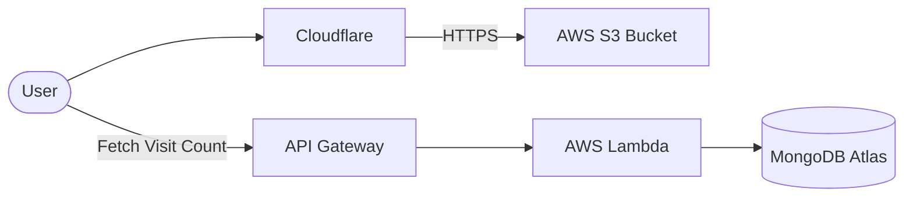

# 📄 Cloud Resume Challenge - Resume (Frontend)

github repo: https://github.com/jamesadewara/cloud-resume-challenge-resume.git

The frontend of the Cloud Resume Challenge, featuring a responsive, modern resume design.

## 📐 Architecture



## ✨ Features

- **Responsive Design**: Fully optimized for mobile, tablet, and desktop.
- **Dynamic Content**: Integrates with a Python API to display live visitor counts.
- **Modern Styling**: Clean CSS architecture for a professional look.
- **Fast Loading**: Optimized assets for minimal latency.

## 🛠️ Local Development

To view the resume locally:
1. Open `index.html` directly in any modern web browser.
2. Alternatively, use a local server like Live Server (VS Code) or:
   ```bash
   python -m http.server 3000
   ```

## 📂 Structure

- `index.html`: The core structure and content of the resume.
- `styles.css`: Custom styling and layout (Vanilla CSS).
- `main.js`: Logic for fetching the visitor counter and interactive elements.

## 🚀 Deployment

This site is automatically deployed to an **AWS S3** bucket whenever changes are pushed to the repository. The traffic is routed through **Cloudflare** for edge caching and SSL.

---
*Part of the Cloud Resume Challenge.*